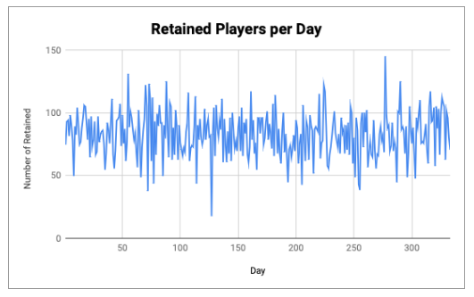
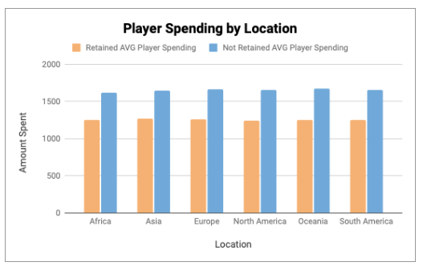
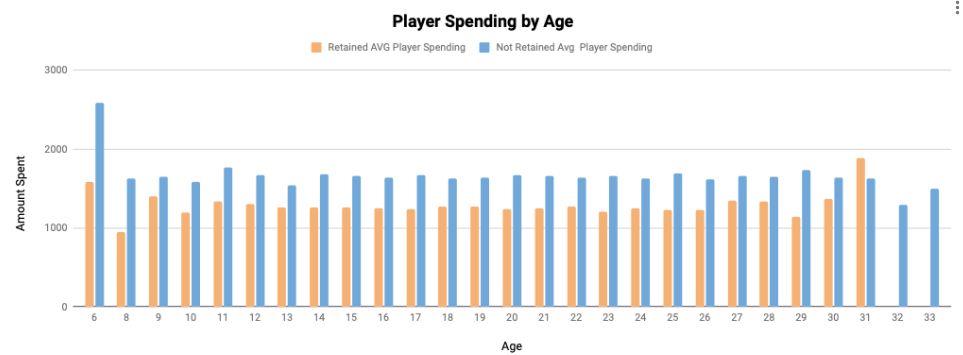
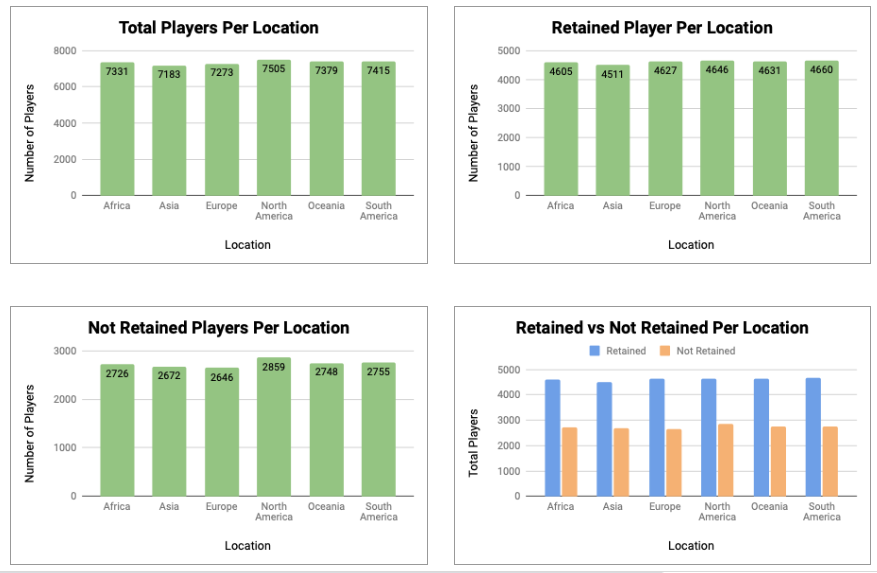

## SQL QUERIES
*Query 1*: Determines the total amount of players retained and how many have joined for each day of a calendar year. From there we calculate the fractional retention of those retained players. 

*Query 2*: The following queries below is pulling all the player information such as player_id and age to create a full analysis on 30 day retention

## Analysis of 30 day retention:

### 30 Day Retention: Lifecycle

Looking at the spreadsheet we can see that there is a steady number of retained players based off the days they have joined the game. The company throughout the year has retained more the 50 throughout the year. There have been some spikes for example on day 127 where there was a large dip of only 18 retained players but it balanced out where on day 55 and day 290 there were large retention numbers of 131 and 125. Overall this game company has been able to achieve a successful retention rate throughout the year. 

*Graph 1*: Futher refrence refer to sheet “Retention” on the spreadsheet “Final Retention”. Graph titled ‘Retained Players per Day’

### 30 Day Retention: Player spending

For the lifecycle of the game based off location, player spending did not factor in retained players and not retained players. Looking at age as well it is shown that retained played tended to spend less. The age range that was viewed as 6 to 33 years old.

*Graph 2*: Futher refrence refer to sheet “Player Spending” on the spreadsheet “General Player Information”. Graph titled ‘Player Spending by Age’ and ‘Player Spending by Location’

### 30 Day Retention: Location

Overall looking at location of players their is a higher number of retained players based on the each continent but as it turns out there is not a significant difference as to whether a certain continent had more retained players then another. 

*Graph 3*: Further refrence refer to sheet “Location” on the spreadsheet “General Player Information”. Graph titled ‘Total Players Per Location’ and ‘Retained Player Per Location’  and ‘Not Retained Player Per Location’ and ‘Retained vs Not Retained Per Location’

## References: 
Spreadsheet “Final Retention” : https://docs.google.com/spreadsheets/d/1sEAaqhHQhbVkZGxR7n8lVR7U8vXrUsBzjMlQJZ_UQBY/edit?usp=sharing

Spreadsheet “ General Player Information”: https://docs.google.com/spreadsheets/d/1YMIoc2P7YYcDyuHQ809qk38UjsMUBnUChE1FllMi_yo/edit?usp=sharing

SQL Queries: Please refer to text file names "sqlQuery.txt"
